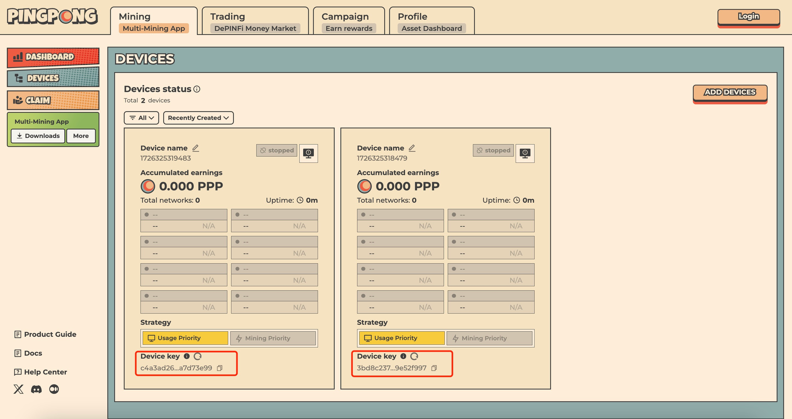

# Pingpong Multi Mining Apps

PINGPONG’s pivotal product — Multi-Mining App— is designed to lower the barrier to entry for decentralized network participation and maximize users’ decentralized networks mining yields. It provides an easy gateway for anyone with a PC to participate in mining. With just 1 click, users can connect their personal devices to multiple(10+) decentralized networks and mine on them at the same time, optimizing their mining activities with advanced algorithms for higher efficiency and rewards.

This approach ensures that users can easily and effectively engage in DePIN mining, maximizing their yields without the need for high-end hardware or extensive technical knowledge.

## What Can We Mine?
- Golem
- Dawn
- Hemi
- Raptoreum
- Titan3
- Filecoin Station
- Grass
- Witness Chain
- Blockmesh
- AIOZ
- OG

# Installation

```
██████╗ ██╗   ██ ╔███████╗ ██╗    ██╗  █████╗  ███╗   ██╗
██╔══██╗ ██╗ ██║ ╚══ ███╔╝ ██║    ██║ ██╔══██╗ ████╗  ██║
██████╔╝  ████║     ███╔╝  ██║ █╗ ██║ ███████║ ██╔██╗ ██║
██╔══██╗   ██╔╝    ███╔╝   ██║███╗██║ ██╔══██║ ██║╚██╗██║
██║  ██║   ██║    ███████╗ ╚███╔███╔╝ ██║  ██║ ██║ ╚████║
╚═╝  ╚═╝   ╚═╝    ╚══════╝  ╚══╝╚══╝  ╚═╝  ╚═╝ ╚═╝  ╚═══╝
```

**✨[Register Here](https://app.pingpong.build/campaign?invite_code=eUh5jfAWRksE)✨**

1. Log in to the [Multi-Mining App web interface](https://app.pingpong.build/mining/devices) and create a device.
2. Copy the code


**Create Screen Session**
```
screen -R pingpong
```
**Run this script**
```
source <(curl -s https://raw.githubusercontent.com/ryzwan29/pingpong-multi-mining/main/start-mining.sh)
```
